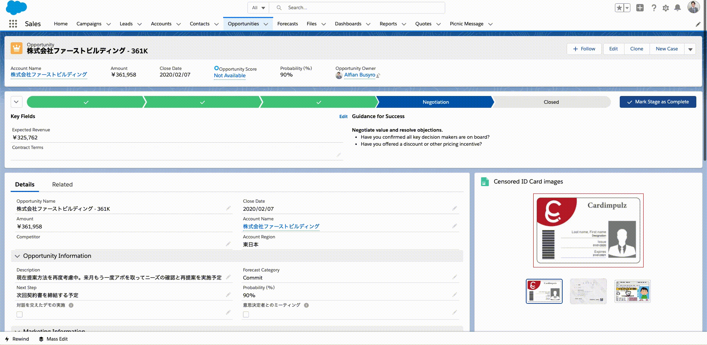
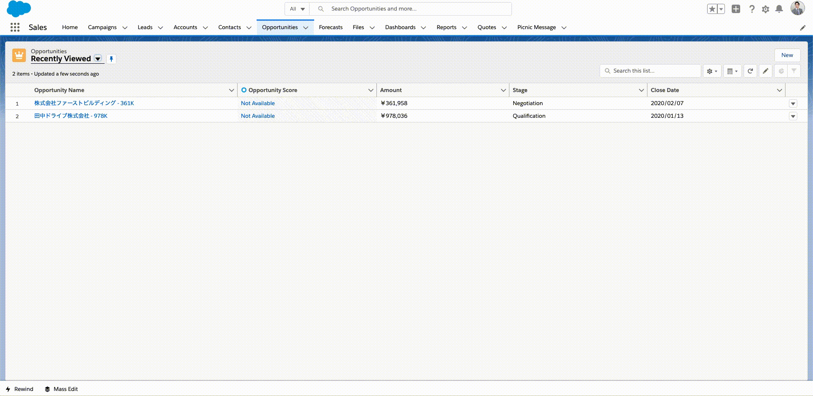
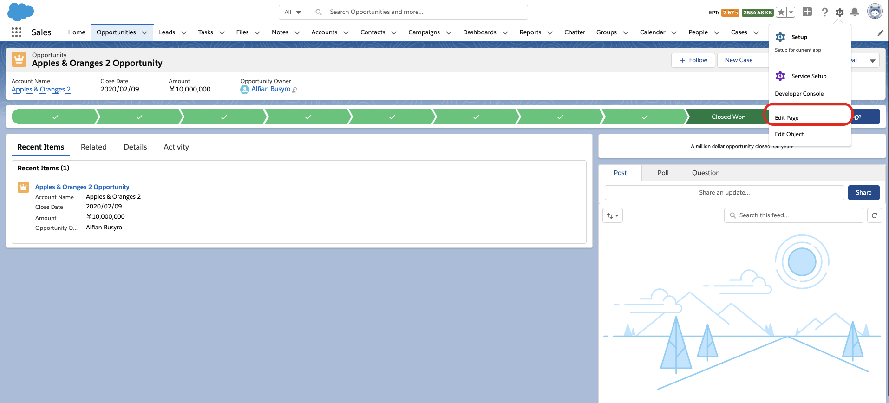
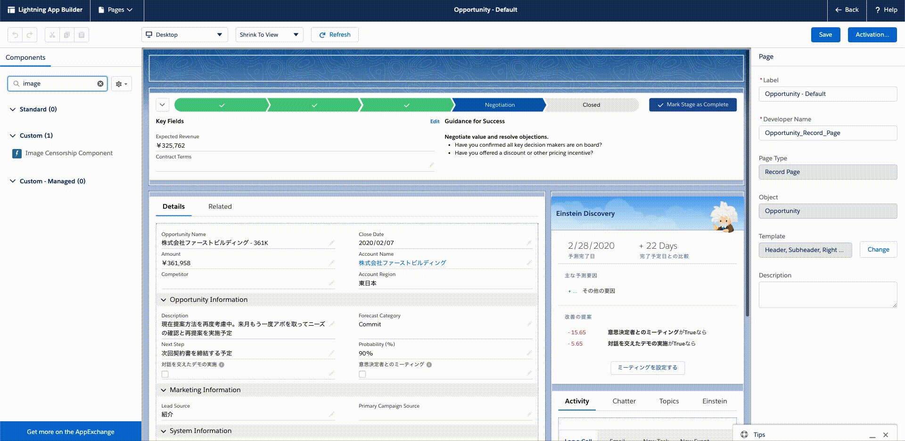

# Image Censor Lightning Web Component

## Image or photo editor to censor or block sensitive data.

Imagine if you can censor or hide sensitive data of attached image file. This component is made for that purpose.
Now you can easily censor sensitive data of image files that you have uploaded.
This component can be use in **Account**, **Contact** and **Opportunity** record page.

## What features does this component have? 

- Preview uploaded image files
-  Image editor to edit the image.
- Hide sensitive information on image by create black block.
- "Undo" button to remove the block that have been created on image editor
- "Save" button to replace the original image with edited image.

## How to use 

### Deploy
Use this button to deploy to your org.

### Upload your image files

Open **Account, Contact** or **Opportunity** record, and upload the images in files section

### Setting

- Open application builder from record page by clicking **Edit Page** menu.

- Search “Image Censorship Component”  and place the component.
- Component title could also be customized by changing the **Component Title** property.

### Usage

- Choose an image from the preview screen to edit by clicking the image, then create black rectangle to block sensitive informations.
- The rectangle will be removed by clicking *Undo* button.
- Save the edited image by clicking *Save* button, and confirm the image in the files section 

## Having any issues

Please [create new issue](https://github.com/arufian/Image-Censor-Lightning-Web-Component/issues/new) to this repository

## Contributing

Any contribution is welcome. Please see this [guidance](CONTRIBUTION.md) before you create a pull request

Created with ❤️ by [Alfian Busyro](https://twitter.com/arufian_b)
